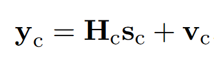

main notes

## 问题 理解

“Multiple Input Multiple Output (MIMO) detection is a common problem encountered in digital communications. In a MIMO system, several transmit antennas simultaneously send different data streams. The receiver often observes a linear superposition of separately transmitted information symbols. From the receiver’s perspective, the problem is then to separate the transmitted symbols. This is basically an inverse problem with a finite-alphabet constraint.  
----  
多输入多输出( MIMO )检测是数字通信中经常遇到的问题。在MIMO系统中，多个发射天线同时发送不同的数据流。接收端经常会观察到单独传输的信息符号的线性叠加。从接收者的角度来看，问题是将发送符号分离。这基本上是一个带有有限字符约束的反问题。” ([pdf](zotero://open-pdf/library/items/5Y6WJBLW?page=1))

“This exercise consists of two parts: (a) formulate the MIMO detection problem as a suitable convex optimization problem; and (b) implement the MIMO receiver. In a group of 2 students, make a short report (4-5 pages; pdf file) containing the required Matlab scripts, plots, and answers. Also, prepare a short presentation to explain your results and defend your choices  
----  
该工作包括两个部分：

( a )将MIMO检测问题建模为一个合适的凸优化问题；

( b ) MIMO接收机的实现。在一组2名学生中，制作包含所需Matlab脚本、图表和答案的简短报告( 4 - 5页; pdf文件)。此外，准备一个简短的陈述来解释你的结果和捍卫你的选择” ([Delft, p. 1](zotero://select/library/items/NHVVY2MQ))

## 数据 解释

“received data symbols y_c

, channel matrix, H_c

and the true data symbols s_c” ([Delft, p. 2](zotero://select/library/items/NHVVY2MQ)) 数据符号、信道矩阵以及真实数据符号

从y_c中检测s_c ?为什么用detect？

## assignments

“Formulate the MIMO detection problem as an optimization problem. Suggest a suitable convex approximation (i.e., derive a convex relaxed problem) if the true problem is not convex. Motivate the proposed formulation as well as the relaxation  
----  
将MIMO检测问题建模为优化问题。如果真问题不是凸问题，建议一个合适的凸近似(即,导出一个凸松弛问题)。激励提议的配方以及松弛” ([pdf](zotero://open-pdf/library/items/5Y6WJBLW?page=2))

“Implement the proposed convex optimization problem in your favorite off-the-shelf solver (e.g., CVX, SeDuMi, or YALMIP). How does this ready-made software solve your problem? Comment on the number of iterations, CPU time, and algorithm the ready-made solver uses. Optional : Does your solution based on randomized rounding follow Goemans and Williamson’s theorem; see the reference  
----  
在您喜欢的现成的求解器(如CVX、SeDuMi或YALMIP等)中实现所提出的凸优化问题。这个现成的软件是如何解决你的问题的?对现成的求解器所使用的迭代次数、CPU时间和算法进行评述。可选：基于随机取整的解法是否遵循Goemans和Williamson定理；见参考文献” ([pdf](zotero://open-pdf/library/items/5Y6WJBLW?page=2))

“Optional : Does your solution based on randomized rounding follow Goemans and Williamson’s theorem; see the reference.  
----  
可选：基于随机取整的解法是否遵循Goemans和Williamson定理；见参考文献。” ([pdf](zotero://open-pdf/library/items/5Y6WJBLW?page=2))

“Implement a low-complexity algorithm (e.g., projected (sub)gradient descent for the above problem, or provide a first-order algorithm to solve the primal and dual problems). Compare the obtained results with the solutions from the off-the-shelf solver. Comment on the number of iterations, CPU time, and convergence of your low-complexity algorithm.  
----  
针对上述问题实现低复杂度的算法(例如,投射( sub)梯度下降，或者提供一阶算法求解原问题和对偶问题)。将得到的结果与现成的求解器的解进行比较。对低复杂度算法的迭代次数、CPU时间和收敛性进行评论。” ([pdf](zotero://open-pdf/library/items/5Y6WJBLW?page=2))

presentation

Referred in [main notes](zotero://note/u/LYWHI3QJ/?ignore=1&line=-1)

# Delft - ET4350 Applied Convex Optimization.pdf

## 💡 Meta Data

<table><tbody><tr><th style="background-color: rgb(219, 238, 221);">
Title
</th><td style="background-color: rgb(219, 238, 221);">
&nbsp; &nbsp; &nbsp; &nbsp; &nbsp; &nbsp; Delft - ET4350 Applied Convex Optimization.pdf &nbsp; &nbsp; &nbsp; &nbsp;
</td></tr><tr><th style="background-color: rgb(243, 250, 244);">
Journal
</th><td style="background-color: rgb(243, 250, 244);">

</td></tr><tr><th style="background-color: rgb(219, 238, 221);">
1st Author
</th><td style="background-color: rgb(219, 238, 221);">

</td></tr><tr><th style="background-color: rgb(243, 250, 244);">
Authors
</th><td style="background-color: rgb(243, 250, 244);">

</td></tr><tr><th style="background-color: rgb(219, 238, 221);">
Pub. date
</th><td style="background-color: rgb(219, 238, 221);">

</td></tr><tr><th style="background-color: rgb(243, 250, 244);">
DOI
</th><td style="background-color: rgb(243, 250, 244);">

</td></tr><tr><th style="background-color: rgb(219, 238, 221);">
Archive
</th><td style="background-color: rgb(219, 238, 221);">

</td></tr><tr><th style="background-color: rgb(243, 250, 244);">
Archive Location
</th><td style="background-color: rgb(243, 250, 244);">

</td></tr><tr><th style="background-color: rgb(219, 238, 221);">
Call No.
</th><td style="background-color: rgb(219, 238, 221);">

</td></tr></tbody></table>