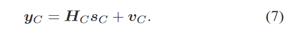

main notes

 In recent years, the semidefinite relaxation (SDR) technique has been at the center of some of the very exciting developments in the area of signal processing and communications, and it has shown great significance and relevance on a variety of applications. Roughly speaking, SDR is a powerful, computationally efficient approximation technique for a host of very difficult optimization problems. In particular, it can be applied to many nonconvex quadratically constrained quadratic programs (QCQPs) in an almost mechanical fashion. These include the following problems:  
  
近年来，半正定松弛( SDR )技术在信号处理和通信领域的一些非常令人兴奋的发展中占据了中心位置，并在各种应用中表现出了重要的意义和相关性。粗略地说，SDR是一种强大的、计算高效的近似技术，适用于许多非常困难的优化问题。特别地，它可以以几乎机械的方式应用于许多非凸二次约束二次规划( QCQPs )。这些包括以下问题：” ([Luo 等, 2010, p. 1](zotero://select/library/items/EX7DMBQ8)) ([pdf](zotero://open-pdf/library/items/A3NRVYA7?page=1))

## 第三节 MIMO

 Eq. (7) is popularly used to model point-to-point multiple-antenna systems such as the spatial multiplexing (or V-BLAST) depicted in Fig. 2. In fact, it is known (see, e.g., \[49\]) that the same model as in (7) can be used to formulate detection problems in many other communication scenarios, such as multiuser systems, space-time coding systems, spacefrequency coding systems, and combinations such as multiuser multi-antenna systems. The wide applicability of the MIMO model (7) makes its respective detection problem attractive and important to tackle  
  
式中：( 7 )被广泛用于点对点多天线系统的建模，如图2所示的空间复用(或V - BLAST)。事实上，已知(例如)，在许多其他通信场景中，如多用户系统、空时编码系统、空频编码系统以及多用户多天线系统等组合中，可以使用与式( 7 )相同的模型来描述检测问题。MIMO模型( 7 )的广泛适用性使得其各自的检测问题具有吸引力和解决的重要性” ([pdf](zotero://open-pdf/library/items/A3NRVYA7?page=3)) ([Luo 等, 2010, p. 3](zotero://select/library/items/EX7DMBQ8))

这一段可以用来改写 motivation

[main notes](zotero://note/u/IW55CLDV/)

# Luo 等 - 2010 - Semidefinite Relaxation of Quadratic Optimization .pdf

## 💡 Meta Data

<table><tbody><tr><th style="background-color: rgb(219, 238, 221);">
Title
</th><td style="background-color: rgb(219, 238, 221);">
&nbsp; &nbsp; &nbsp; &nbsp; &nbsp; &nbsp; Luo 等 - 2010 - Semidefinite Relaxation of Quadratic Optimization .pdf &nbsp; &nbsp; &nbsp; &nbsp;
</td></tr><tr><th style="background-color: rgb(243, 250, 244);">
Journal
</th><td style="background-color: rgb(243, 250, 244);">

</td></tr><tr><th style="background-color: rgb(219, 238, 221);">
1st Author
</th><td style="background-color: rgb(219, 238, 221);">

</td></tr><tr><th style="background-color: rgb(243, 250, 244);">
Authors
</th><td style="background-color: rgb(243, 250, 244);">

</td></tr><tr><th style="background-color: rgb(219, 238, 221);">
Pub. date
</th><td style="background-color: rgb(219, 238, 221);">

</td></tr><tr><th style="background-color: rgb(243, 250, 244);">
DOI
</th><td style="background-color: rgb(243, 250, 244);">

</td></tr><tr><th style="background-color: rgb(219, 238, 221);">
Archive
</th><td style="background-color: rgb(219, 238, 221);">

</td></tr><tr><th style="background-color: rgb(243, 250, 244);">
Archive Location
</th><td style="background-color: rgb(243, 250, 244);">

</td></tr><tr><th style="background-color: rgb(219, 238, 221);">
Call No.
</th><td style="background-color: rgb(219, 238, 221);">

</td></tr></tbody></table>